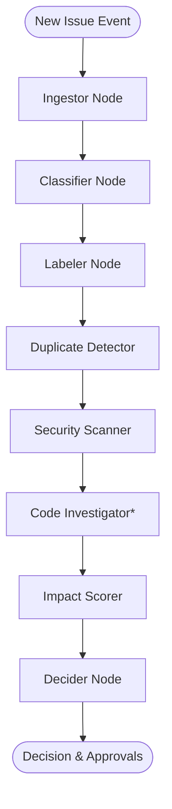
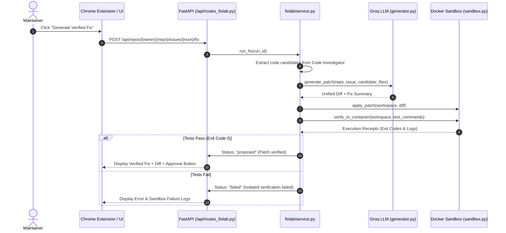

# RepoGuardian / Doombot: Branch Architecture & Feature Reference

> **Comprehensive Technical Guide** comparing `main`, `mayank`, and `tanay` branches, detailing their individual features, AI agent pipelines, memory structures, and architectural workflows.

---

## 1. Executive Summary & Branch Topology

```
                         ┌─────────────────────────────────────────────────────────────┐
                         │                        main branch                          │
                         │  • Core LangGraph Triage Graph (Nodes, State, Chains)       │
                         │  • F16: CodeGraphContext 3D & Flowchart Explorer            │
                         │  • F17: Adaptive Repository Learning (Historical Precedents)│
                         │  • F18: MCP Intelligence Layer (Read-Only Tools)            │
                         │  • VSCode Extension & Base API / Memory Layer               │
                         └──────────────┬──────────────────────────────┬───────────────┘
                                        │                              │
                                        ▼                              ▼
        ┌──────────────────────────────────────────────┐  ┌──────────────────────────────────────────────┐
        │                mayank branch                 │  │                 tanay branch                 │
        │  • "Calm Control Room" Dashboard Redesign    │  │  • FixLab: Autonomous Verified Auto-Fix      │
        │  • 10+ Dedicated Maintainer Pages            │  │  • Code Investigator Triage Node (AST/RAG)   │
        │  • Global Ask RepoGuardian (⌘K) & Palette    │  │  • RepoGuardian Lens Chrome Extension        │
        │  • Real-time WebSocket Status & Toasts       │  │  • Policy Feedback Memory & Index Jobs       │
        │  • First-Run Interactive System Onboarding   │  │  • Lens Rethemed to Mayank "Calm" System     │
        └──────────────────────────────────────────────┘  └──────────────────────────────────────────────┘
```

---

## 2. Shared Core Architecture (The Foundation)

All three branches share a rock-solid foundation designed for deterministic, maintainer-in-the-loop repository intelligence.

### 2.1 Backend & Persistence Stack
- **FastAPI / Uvicorn Server**: Exposes asynchronous REST endpoints under `/api` and real-time WebSockets on `/ws`.
- **Database (`memory/db.py`, `memory/repo.py`)**: SQLite database (`doombot.db`) storing investigations, investigation steps, decisions, feedback, approvals, and fix runs.
- **RAG Vector Store (`rag/`)**: ChromaDB vector index backed by HuggingFace `all-MiniLM-L6-v2` local embeddings (384-dimensional dense vectors) for issues and code snippets.
- **Groq LLM Engine**: Powered by `openai/gpt-oss-120b` (or Llama-3 models) with strict JSON schema outputs and fallback validation.

### 2.2 LangGraph Autonomous Triage Pipeline
The multi-step deterministic triage graph (`agents/triage_graph.py`):


*\*Note: `Code Investigator` is introduced in the `tanay` branch.*

Each step is wrapped with `@chain_step`, automatically recording its inputs, generated evidence citations, execution duration, and persisting it to SQLite for live replay and audit trails.

---

## 3. Branch Deep-Dive: `main`

The `main` branch contains the finalized core agentic features: F16, F17, and F18.

### 3.1 Key Features & Capabilities

#### A. F17: Adaptive Repository Learning (`agents/triage/labeler.py`, `rag/retriever.py`)
- **Dynamic Precedent Retrieval**: When triaging a new issue, the labeler queries ChromaDB for closed historical issues with cosine similarity above `RELATED_THRESHOLD` (0.65).
- **Taxonomy Adaptation**: The agent learns project-specific labeling patterns without hardcoded rules. If past upload errors in the repo were labeled `site:youtube` or `network-timeout`, the agent understands the context while strictly conforming output labels to the project's valid taxonomy.
- **Zero-Failure Degradation**: If vector retrieval is offline or the repo is brand new, the system gracefully falls back to baseline zero-shot classification without crashing.

#### B. F18: Model Context Protocol (MCP) Intelligence Layer (`mcp_server/intelligence.py`)
- Exposes Doombot repository intelligence to any external MCP-compliant IDE or LLM client (e.g., Claude Desktop, Cursor, Codex).
- **Read-Only Intelligence Tools**:
  - `search_issues_mcp(repo_name, query, limit)`: Semantic similarity search across historical issue database.
  - `find_duplicates_mcp(repo_name, issue_number)`: Exact and semantic duplicate detection.
  - `explain_decision_mcp(repo_name, issue_number)`: Traces decision rationale, evidence graphs, and factors.
  - `get_repo_health_mcp(repo_name)`: Returns real-time responsiveness, staleness, duplication, and security scores.
  - `get_subsystem_hotspots_mcp(repo_name)`: Identifies files and modules with high defect density.
- **Strict Safety Gate**: Write tools (applying labels, posting comments) remain gated behind the maintainer approval center and cannot be bypassed via MCP.

#### C. F16: CodeGraphContext Graph Explorer (`rag/graph.py`, `dashboard/src/components/explorer/`)
- Builds an AST dependency and reference graph across repository files.
- Visualizes code architecture in interactive 3D Force-Directed and 2D Flowchart views.
- Traces cross-file dependencies, imports, and call paths to contextualize bug reports.

#### D. VSCode Extension (`vscode-extension/`)
- Native VSCode sidebar containing:
  - Attention Queue tree view.
  - Interactive Webview for inspecting investigation traces and approving actions.

---

## 4. Branch Deep-Dive: `mayank` (Dashboard & Experience)

The `mayank` branch focuses on a **maintainer-centric command center** and introducing the **"Calm Control Room"** design system.

### 4.1 "Calm Control Room" Design System
- **Color Palette**: Warm off-white canvas (`#f3f2ee`), crisp white cards (`#ffffff`), dark ink typography (`#111111`), vibrant orange-red accent (`#ff5a36`), and clear semantic status tones (Info Blue `#246bfe`, Success Green `#19a974`, Warning Amber `#e7a928`, Danger Red `#e5484d`).
- **Tactile Brutalism**: Distinct flat drop shadows (`2px 2px 0 0 rgba(17,17,17,0.85)` / `3px 3px 0 0`), physical hover lifts (`.card-lift`), and severity accent ribbons (`border-l-4`).
- **Typography**: Dual-font hierarchy using Google Fonts `Inter` (UI) and `JetBrains Mono` (code, scores, issue IDs).

### 4.2 Comprehensive Page Architecture

| Page | Route | Key Features & Workflow |
|---|---|---|
| **Command Center** | `/` | Real-time triage summary, top attention items, quick metrics, agent online status indicator. |
| **Needs You** | `/attention` | Filtered queue of issues requiring maintainer judgment (escalations, ambiguous cases). |
| **Duplicate Intelligence** | `/duplicates` | Semantic clustering of duplicate bug reports with similarity tracks and canonical issue pointers. |
| **Security Signals** | `/security` | CVE keyword matches, token/secret leaks, and gated security labeling approvals. |
| **Project Health** | `/health` | 4-quadrant scoring (Responsiveness, Staleness, Duplication, Security) with agent narrative take. |
| **Project Memory** | `/memory` | Tree-structured breakdown of indexed subsystems, historical decisions, and evidence anchors. |
| **Agent Activity** | `/activity` | Live audit stream of all background agent runs, LangGraph node events, and execution times. |
| **Decisions Log** | `/decisions` | Historical repository of all decisions (`escalate`, `silent`, `follow_up`, `duplicate`) with confidence rings. |
| **Approval Center** | `/approvals` | Dedicated queue for approving or rejecting proposed GitHub actions (labels, comments, PRs). |
| **Weekly Brief** | `/brief` | LLM-synthesized weekly maintenance digest summarizing trends, hotspots, and resolved issues. |
| **Ask RepoGuardian** | `⌘K` / `/ask` | Global intelligent modal answering questions grounded strictly in indexed repository memory. |
| **First Run / Onboarding**| `/onboarding` | Interactive setup wizard guiding users through repository indexing, token verification, and health analysis. |

---

## 5. Branch Deep-Dive: `tanay` (FixLab & Chrome Extension)

The `tanay` branch introduces **autonomous code-level root-cause diagnosis, verified patch generation, and in-situ GitHub browsing via Chrome Extension**.

### 5.1 Key Features & Modules

#### A. FixLab: Verified Patch Generation (`fixlab/`)
FixLab is an autonomous code repair pipeline that goes beyond issue triage to generate and verify actual code patches in isolated sandbox containers.



- **Non-Publishing Safety Guarantee**: Generated patches are *never* pushed or published to GitHub automatically. They remain sandboxed until an explicit human maintainer clicks "Approve".
- **Real Verification Receipts**: Verifies patches by running real test suites (`pytest`, `npm test`, etc.) inside isolated containers.

#### B. Code Investigator LangGraph Node (`agents/triage/code_investigator.py`)
- Integrates directly into the core triage graph.
- Uses AST symbol extraction and semantic code snippet search (`rag/retriever.py:find_code_context`).
- Maps bug reports to specific files, functions, and line ranges (`file.py::handle_request:45`).
- Generates bounded hypotheses on why the bug occurs to supply context for both human reviewers and FixLab.

#### C. RepoGuardian Lens Chrome Extension (`repoguardian-lens/`)
A production-ready Chrome Extension (Manifest V3, React 19, Vite, TailwindCSS) embedding Doombot directly inside GitHub:
- **In-Situ GitHub Observer**: Detects whether the user is browsing an Issue, a Pull Request, or a Repository root (`githubObserver.ts`, `githubContext.ts`).
- **Slide-Out Side Panel**: Seamless toggle (`⌘G` or floating trigger button) displaying real-time issue diagnostics, duplicate detection, and health scores.
- **FixLab Card**: Directly trigger patch generation and view verification receipts without leaving GitHub.
- **Dual Mode Architecture**:
  - **Live Mode**: Connects to the local FastAPI backend and GitHub API.
  - **Offline Demo Mode**: Self-contained deterministic mock engine (`MockAgentEngine.ts`, `demoScript.ts`) for offline presentations.
- **Theme Sync**: Fully aligned with Mayank's "Calm Control Room" aesthetic (warm cream, flat brutalist shadows, animated pulse rings, and high-contrast white active selections).

#### D. Policy Memory & Dynamic Indexing (`memory/repo.py`, `api/routes_repos.py`)
- Asynchronous job queue for background repository indexing with real-time percentage progress.
- Policy memory database recording maintainer overrides and feedback to calibrate future triage runs.

---

## 6. Feature Comparison Matrix

| Capability / Feature Area | `main` | `mayank` | `tanay` |
|---|:---:|:---:|:---:|
| **Core LangGraph Triage Pipeline** | ✅ Complete | ✅ Complete | ✅ Complete |
| **Adaptive Repository Learning (F17)** | ✅ Full | ⚠️ Baseline | ⚠️ Baseline |
| **MCP Intelligence Layer (F18)** | ✅ Full | ⚠️ Baseline | ⚠️ Baseline |
| **CodeGraphContext 3D Explorer (F16)** | ✅ Full | ✅ Full | ⚠️ Integrated |
| **"Calm Control Room" Dashboard UI** | ❌ Standard | ✅ Full 10+ Pages | ⚠️ Baseline Dashboard |
| **Global Ask RepoGuardian (⌘K)** | ❌ | ✅ Modal & Page | ❌ Dashboard only |
| **First-Run Onboarding Wizard** | ❌ | ✅ Full | ❌ |
| **FixLab Auto-Fix & Test Sandbox** | ❌ | ❌ | ✅ Full Pipeline |
| **Code Investigator Triage Node** | ❌ | ❌ | ✅ AST + Grounding |
| **RepoGuardian Lens Chrome Extension** | ⚠️ Baseline | ❌ | ✅ Full + Mayank Theme |
| **Policy Feedback Memory Loop** | ⚠️ Partial | ⚠️ Partial | ✅ Full |
| **Async Indexing Job Queue** | ⚠️ Partial | ⚠️ Partial | ✅ Full |

---

## 7. Recommended Integration Strategy

To build the ultimate unified repository intelligence platform, combine the three streams into a master release:

1. **Base**: Use the `main` branch for the core agent graph, adaptive learning (F17), and the MCP intelligence layer (F18).
2. **Frontend UI**: Adopt the `mayank` branch's comprehensive 10-page dashboard and design system.
3. **Execution & Tools**: Merge `tanay`'s `fixlab/` verification sandbox, `code_investigator.py` graph node, and the `repoguardian-lens/` Chrome extension.
